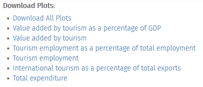

# dygraph-extra

A modified version of the original
[dygraph-extra](http://cavorite.com/labs/js/dygraphs-export/)
JavaScript library that adds the ability to export dygraph plots as a
png image, among other things.

Dependencies:
- [jQuery](https://jquery.com/) (loaded by shiny automatically)
- [JSZip](https://stuk.github.io/jszip/) (only required if downloading
  multiple dygraphs in a single link)

License:
- The modifications were made by Jimmy Oh for the [Ministry of
Business, Innovation and Employment](http://www.mbie.govt.nz/). It is
released under [CC
BY](http://creativecommons.org/licenses/by/4.0/). Attribution should
be made to MBIE.

## dygraph-extra.js

This is a modified version of `dygraph-extra.js` originally released
in 2011 by Juan Manuel Caicedo Carvajal.

The modifications are:
- Fixed y label positioning.
- Automatic detectection of fonts for the labels, rather than relying
  on predefined or user-supplied fonts. This still isn't perfect, but
  should be closer to the actual dygraph.
- Fix overflow of legends for too many series (legends now wrap).
- A method for registering dygraphs via a drawcallback, primarily
  useful for those using the R version of dygraphs.
- A function for downloading one or more registered dygraphs where
  the dygraphs to download are identified by their id and where
  multiple plots are zipped together using JSZip.
- Functions to address some bugs/annoyances with dygraphs:
  + correct automatic resize on visiblity change.
  + correct clearance of selection on mouseleave.

## dygraph-extra-shiny.R

Contains a number of R functions that make it easier to use
`dygraph-extra.js` in shiny.

### Example: dyDownload

```R
dyDownload("dyout", "Download Plot", asbutton = TRUE)
```

### Example: dyDownloadGroup

```R
dyDownloadGroup("oecoDyDownloads", "Download Plots:", c(
      "Value added by tourism as a percentage of GDP" = "oecogdpperc",
      "Value added by tourism" = "oecogdp",
      "Tourism employment as a percentage of total employment" = "oecoempperc",
      "Tourism employment" = "oecoemp",
      "International tourism as a percentage of total exports" = "oecoexpperc",
      "Total expenditure" = "oecospend"
   ))
```
